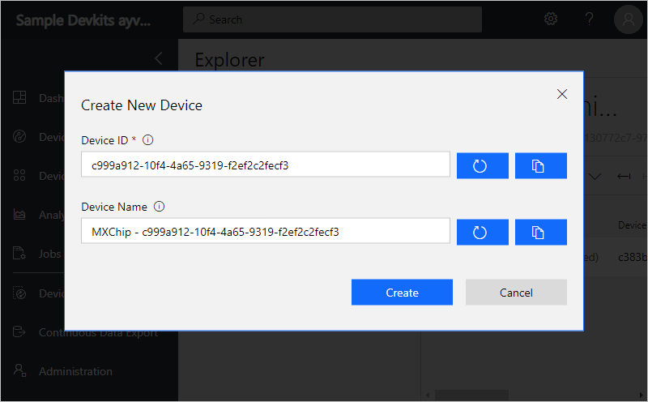
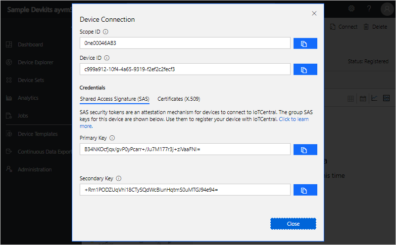

# AI and IoT Hackdays - IoT Central AmoebaBot

## Getting Started

Deploy IoT Central Application via the following URL (use Chrome):  https://apps.azureiotcentral.com/create?appTemplate=0d77c0a5-1b74-4846-911b-804656e96bd7

 

 

### Provisioning

Wait until the new IoT Central Applicaiton is created.

 
 
 

## Connect AmoebaBot device to your Azure IoT Central application

### Add a real device

Get your device connection details
In your Azure IoT Central application, add a real device from the **AmoebaBot** device template and make a note of the device connection details: Scope ID, Device ID, and Primary key:

Add a real device from Device Explorer, select +New > Real to add a real device.

Enter a lowercase Device ID, or use the suggested Device ID.
Enter a Device Name, or use the suggested name
Add Device

To get the device connection details, Scope ID, Device ID, and Primary key, select Connect on the device page.

**Connection details**

Make a note of the connection details. You're temporarily disconnected from the internet when you prepare your DevKit device in the next step.

Prepare the DevKit device
If you've previously used the device and want to reconfigure it to use a different WiFi network, connection string, or telemetry measurement, press both the A and B buttons at the same time. If it doesn't work, press Reset button and try again.

To prepare the DevKit device
Download the latest **AmoebaBot-IoT-Central-1.4-Beta.bin** Azure IoT Central firmware for the MXChip from the firmware folder on GitHub.

Connect the DevKit device to your development machine using a USB cable. In Windows, a file explorer window opens on a drive mapped to the storage on the DevKit device. For example, the drive might be called AZ3166 (D:).

Drag the **AmoebaBot-IoT-Central-1.31.bin** (found in firmware folder) file onto the drive window. When the copying is complete, the device reboots with the new firmware.

When the DevKit device restarts, the following screen displays:

Copy
Connect HotSpot:
AZ3166_??????
go-> 192.168.0.1
PIN CODE xxxxx
 Note

If the screen displays anything else, reset the device and press the A and B buttons on the device at the same time to reboot the device.

The device is now in access point (AP) mode. You can connect to this WiFi access point from your computer or mobile device.

On your computer, phone, or tablet connect to the WiFi network name shown on the screen of the device. When you connect to this network, you don't have internet access. This state is expected, and you're only connected to this network for a short time while you configure the device.

Open your web browser and navigate to http://192.168.0.1/start. The following web page displays:

**Device configuration page**

On the web page, enter:

The name of your WiFi network
Your WiFi network password
The PIN code shown on the device's display
The connection details Scope ID, Device ID, and Primary key of your device (you should have already saved this following the steps)
Select all the available telemetry measurements
After you choose Configure Device, you see this page:

**Device configured**

Press the **Reset** button on your device.

## Update Dashboard to use new Device

 
 
 

## Drive AmoebaBot

When AmoebaBot successfully connects to Wifi and IoT Central.   Access the commands menu form the AmoebaBot Device set up in IoT Central.

 
 
 

